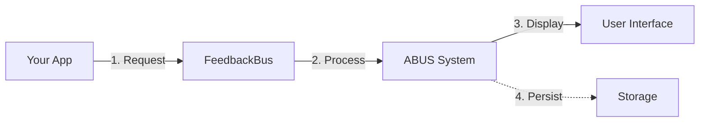
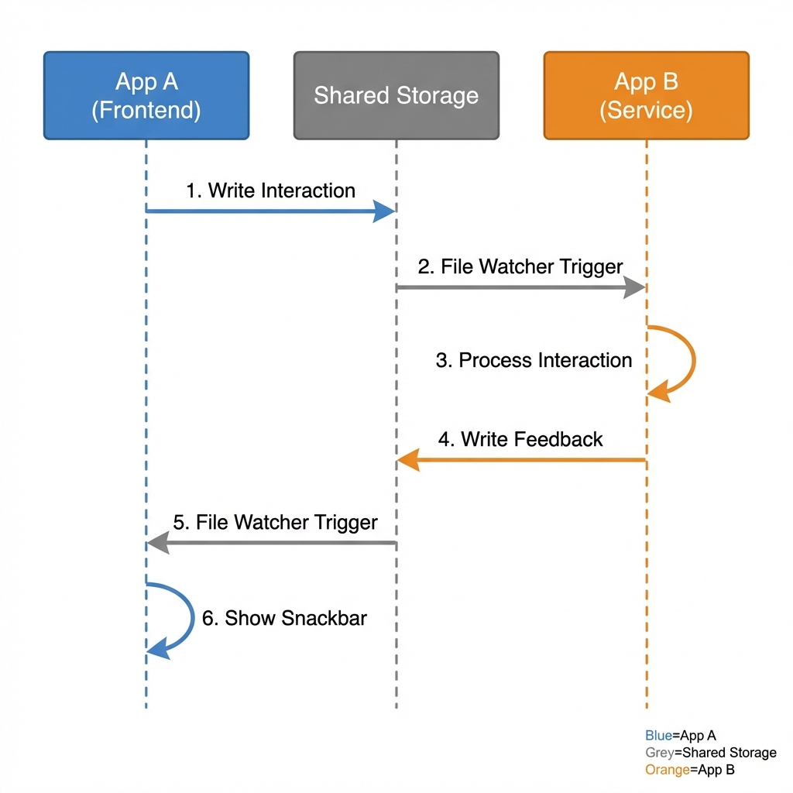

# ABUS - A-synchronous Business Unified System

## Overview

ABUS (A-synchronous Business Unified System) is a comprehensive Flutter package that provides a unified approach to handling asynchronous operations, state management, and API interactions with built-in optimistic updates, rollback capabilities, and error handling.

## Core Concept

ABUS implements an **optimistic-first architecture** where:
1. UI updates happen immediately (optimistic updates)
2. API calls execute in the background
3. Changes are automatically rolled back if the API fails
4. Success confirmations prevent rollbacks

This approach provides excellent user experience while maintaining data consistency.

## Key Features

### 🚀 Optimistic Updates
- Immediate UI feedback without waiting for API responses
- Automatic rollback on API failures
- Configurable rollback timeouts

### 🔄 State Management Integration
- Works with BLoC, Provider, and custom state management solutions
- Mixin-based approach for easy integration
- Automatic widget rebuilds on interaction results

### ⚡ Interaction Queue
- Prevents race conditions with automatic queuing
- Priority-based execution
- Duplicate interaction prevention

### 🎯 Flexible Handler System
- Multiple handler types (BLoC, Provider, Custom)
- Global and local API handlers
- Handler-specific validation and execution

### 📊 Result Streaming
- Real-time interaction result broadcasting
- Filterable result streams
- Debounced widget updates

### 🏗️ Type-Safe Interactions
- Support for both generic (Map-based) and typed (class-based) interactions
- Type-safe payload handling in results
- Custom JSON serialization support

## Core Architecture

### 1. Interaction Definitions (`InteractionDefinition`)
The foundation of ABUS - defines what operation should be performed. Now supports both generic and typed interactions.

```dart
abstract class InteractionDefinition {
  String get id;                    // Unique identifier
  Map<String, dynamic> toJson();    // Serialization
  InteractionDefinition? createRollback();  // Optional rollback definition
  Duration? get timeout;            // Operation timeout
  bool get supportsOptimistic;      // Optimistic update support
  int get priority;                 // Execution priority
  Set<String> get tags;             // Categorization tags
  Object? get payload;              // Typed payload (for ClassInteraction)
  Type? get payloadType;            // Payload type information
  bool validate();                  // Validation
  List<String> getValidationErrors(); // Validation errors
}
```

#### Generic Interactions (Map-based)
For simple operations with flexible data structures:

```dart
final interaction = GenericInteraction(
  id: 'update_user_settings',
  data: {
    'userId': '123',
    'settings': {
      'theme': 'dark',
      'notifications': true,
    },
  },
  timeout: Duration(seconds: 10),
  tags: {'user', 'settings'},
);
```

#### Class-Based Interactions (Typed)
For type-safe operations with defined data models:

```dart
class User {
  final String id;
  final String name;
  final String email;

  User({required this.id, required this.name, required this.email});

  Map<String, dynamic> toJson() => {
    'id': id,
    'name': name,
    'email': email,
  };
}

final interaction = ClassInteraction<User>(
  id: 'create_user',
  payload: User(id: '123', name: 'John Doe', email: 'john@example.com'),
  timeout: Duration(seconds: 15),
  tags: {'user', 'create'},
);
```

**Key Features:**
- **Immutable Operations**: Each interaction is a complete description of an operation
- **Self-Contained**: Includes all necessary data and metadata
- **Rollback Support**: Optional rollback definitions for complex operations
- **Priority System**: High-priority operations execute first
- **Tagging**: Categorize operations for filtering and handling
- **Validation**: Built-in validation with error reporting

### 2. Result System (`ABUSResult`)
Enhanced to support typed payloads alongside generic data:

```dart
class ABUSResult {
  final bool isSuccess;
  final Map<String, dynamic>? data;    // Generic data
  final Object? payload;               // Typed payload
  final String? error;
  final DateTime timestamp;
  final String? interactionId;
  final Map<String, dynamic>? metadata;

  // Type-safe payload access
  T? getPayload<T>();
  Type? get payloadType;
  bool hasPayloadType<T>();
}
```

#### Working with Typed Results
```dart
final result = await ABUS.execute(userInteraction);

if (result.isSuccess) {
  // Type-safe payload access
  final user = result.getPayload<User>();
  if (user != null) {
    print('Created user: ${user.name}');
  }

  // Check payload type
  if (result.hasPayloadType<User>()) {
    print('Payload is a User object');
  }

  // Generic data access still available
  final metadata = result.data?['metadata'];
}
```

### 3. Handler System (`AbusHandler`)
Handles the actual execution of interactions across different state management patterns.

```dart
abstract class AbusHandler {
  String get handlerId;
  bool canHandle(InteractionDefinition interaction);
  Future<void> handleOptimistic(String interactionId, InteractionDefinition interaction);
  Future<void> handleRollback(String interactionId, InteractionDefinition interaction);
  Future<void> handleCommit(String interactionId, InteractionDefinition interaction);
  Future<ABUSResult>? executeAPI(InteractionDefinition interaction);
  Map<String, dynamic>? getCurrentState(InteractionDefinition interaction);
}
```

**Handler Types:**
- **AbusBloc**: Mixin for BLoC pattern integration
- **AbusProvider**: Mixin for Provider pattern integration
- **CustomAbusHandler**: For custom state management solutions

### 4. Manager (`ABUSManager`)
The central orchestrator that coordinates all operations.

**Core Responsibilities:**
- **Handler Registration**: Manages all registered handlers
- **Operation Queuing**: Prevents race conditions through intelligent queuing
- **State Snapshots**: Captures state before operations for rollback capability
- **Memory Management**: Automatic cleanup of old snapshots and timers
- **Result Broadcasting**: Streams results to interested components

## Execution Flow

### Standard Flow
1. **Define Interaction**: Create an `InteractionDefinition` describing the operation
2. **Handler Discovery**: Manager finds compatible handlers
3. **State Snapshot**: Current state captured for potential rollback
4. **Optimistic Update**: UI updated immediately (if enabled)
5. **API Execution**: Actual API call performed
6. **Success/Failure Handling**:
   - **Success**: Changes committed, snapshot cleaned up
   - **Failure**: Automatic rollback to previous state

### Optimistic Updates Flow
```dart
// 1. User triggers action
final interaction = InteractionTypes.crud(
  action: 'update',
  resourceType: 'user',
  resourceId: '123',
  payload: {'name': 'New Name'},
);

// 2. Immediate UI update
await ABUS.execute(interaction);
// UI shows "New Name" immediately

// 3. If API fails, automatic rollback
// UI reverts to previous state
```

## Key Features (Detailed)

### 🚀 Optimistic Updates
- **Immediate UI Response**: Users see changes instantly
- **Automatic Rollback**: Failed operations automatically revert
- **State Preservation**: Previous state captured and restored perfectly
- **Configurable**: Can be disabled per interaction or globally

### 🔒 Race Condition Prevention
- **Operation Queuing**: Prevents concurrent operations with same ID
- **Priority System**: Important operations execute first
- **Timeout Handling**: Operations that take too long are automatically handled

### 🎯 Flexible Handler System
- **Multi-Pattern Support**: Works with BLoC, Provider, setState, or custom patterns
- **Handler Discovery**: Automatic discovery of handlers in widget tree
- **Manual Registration**: Explicit handler registration for better control

### 📊 Memory Management
- **Snapshot Limits**: Automatic cleanup of old state snapshots
- **Timer Management**: Automatic cleanup of rollback timers
- **Resource Cleanup**: Proper disposal prevents memory leaks

### 🔍 Comprehensive Result System
```dart
class ABUSResult {
  final bool isSuccess;
  final Map<String, dynamic>? data;
  final Object? payload;               // NEW: Typed payload support
  final String? error;
  final DateTime timestamp;
  final String? interactionId;
  final Map<String, dynamic>? metadata;
}
```

## Usage Examples

### Basic CRUD Operations

#### Generic CRUD (Map-based)
```dart
// Create with generic data
final createUser = InteractionTypes.crud(
  action: 'create',
  resourceType: 'user',
  payload: {'name': 'John', 'email': 'john@example.com'},
);

// Update with optimistic updates
final updateUser = InteractionTypes.crud(
  action: 'update',
  resourceType: 'user',
  resourceId: '123',
  payload: {'name': 'Jane'},
  optimistic: true,
);

final result = await ABUS.execute(updateUser);
```

#### Typed CRUD (Class-based)
```dart
class User {
  final String name;
  final String email;

  User(this.name, this.email);

  Map<String, dynamic> toJson() => {'name': name, 'email': email};
}

// Create with typed payload
final createUser = InteractionTypes.crudWithPayload<User>(
  action: 'create',
  resourceType: 'user',
  payload: User('John Doe', 'john@example.com'),
);

// Update with typed payload
final updateUser = InteractionTypes.crudWithPayload<User>(
  action: 'update',
  resourceType: 'user',
  resourceId: '123',
  payload: User('Jane Doe', 'jane@example.com'),
  optimistic: true,
);

final result = await ABUS.execute(updateUser);

// Type-safe result handling
if (result.isSuccess) {
  final user = result.getPayload<User>();
  print('User updated: ${user?.name}');
}
```

### Using the Interaction Builder

#### Generic Interactions
```dart
final customInteraction = InteractionBuilder()
  .withId('sync_user_data')
  .withData({'userId': '123', 'includePreferences': true})
  .withTimeout(Duration(seconds: 30))
  .withPriority(1)
  .addTag('sync')
  .addTag('critical')
  .build();
```

#### Typed Interactions
```dart
class SyncRequest {
  final String userId;
  final bool includePreferences;

  SyncRequest(this.userId, this.includePreferences);

  Map<String, dynamic> toJson() => {
    'userId': userId,
    'includePreferences': includePreferences,
  };
}

final typedInteraction = InteractionBuilder<SyncRequest>()
  .withId('sync_user_data')
  .withPayload(SyncRequest('123', true))
  .withTimeout(Duration(seconds: 30))
  .withPriority(1)
  .addTags(['sync', 'critical'])
  .build();
```

### Widget Integration with Type Support

```dart
class UserProfile extends StatefulWidget {
  @override
  _UserProfileState createState() => _UserProfileState();
}

class _UserProfileState extends State<UserProfile> with AbusWidgetMixin {
  @override
  AbusUpdateConfig get abusConfig => AbusUpdateConfig(
    tags: {'user', 'profile'},
    debounceDelay: Duration(milliseconds: 300),
    rebuildOnSuccess: true,
  );

  @override
  void onAbusResult(ABUSResult result) {
    if (result.isSuccess) {
      // Handle typed payloads
      final user = result.getPayload<User>();
      if (user != null) {
        ScaffoldMessenger.of(context).showSnackBar(
          SnackBar(content: Text('User ${user.name} updated successfully')),
        );
      }
    } else {
      ScaffoldMessenger.of(context).showSnackBar(
        SnackBar(content: Text('Error: ${result.error}')),
      );
    }
  }

  void updateUser() {
    final user = User('New Name', 'new@example.com');

    // Using typed interaction
    final interaction = ClassInteraction<User>(
      id: 'update_user_profile',
      payload: user,
    );

    executeInteraction(interaction);
  }

  void updateUserGeneric() {
    // Using generic interaction
    final interaction = GenericInteraction(
      id: 'update_user_profile',
      data: {
        'resourceType': 'user',
        'action': 'update',
        'payload': {'name': 'New Name', 'email': 'new@example.com'},
      },
    );

    executeInteraction(interaction);
  }
}
```

### Handler Implementation with Type Support

```dart
class UserBloc extends Bloc<UserEvent, UserState> with AbusBloc {
  @override
  bool canHandle(InteractionDefinition interaction) {
    // Handle both generic and typed user interactions
    if (interaction is ClassInteraction) {
      return interaction.payload is User || interaction.id.contains('user');
    }
    return interaction.toJson()['data']?['resourceType'] == 'user';
  }

  @override
  Future<void> handleOptimistic(String interactionId, InteractionDefinition interaction) async {
    if (interaction is ClassInteraction<User>) {
      // Type-safe handling
      final user = interaction.payload;
      emit(state.copyWith(user: user));
    } else if (interaction is GenericInteraction) {
      // Generic handling
      final data = interaction.data;
      if (data['action'] == 'update' && data['payload'] is Map<String, dynamic>) {
        final userMap = data['payload'] as Map<String, dynamic>;
        final updatedUser = state.user.copyWith(name: userMap['name']);
        emit(state.copyWith(user: updatedUser));
      }
    }
  }

  @override
  Future<ABUSResult> executeAPI(InteractionDefinition interaction) async {
    try {
      if (interaction is ClassInteraction<User>) {
        // Type-safe API call
        final user = interaction.payload;
        final response = await userRepository.createUser(user);

        return ABUSResult.success(
          data: response,
          payload: user, // Return the typed payload
          interactionId: interaction.id,
        );
      } else if (interaction is GenericInteraction) {
        // Generic API call
        final data = interaction.data;
        final response = await userRepository.updateUser(
          data['resourceId'],
          data['payload'],
        );

        return ABUSResult.success(data: response);
      }

      return ABUSResult.error('Unsupported interaction type');
    } catch (e) {
      return ABUSResult.error(e.toString());
    }
  }

  @override
  Future<void> handleRollback(String interactionId, InteractionDefinition interaction) async {
    // Revert to previous state
    emit(previousState);
  }
}
```

## Configuration Options

### Global Configuration
```dart
void main() {
  // Register global API handlers
  ABUS.registerApiHandler((interaction) async {
    // Global API handling logic
    return await apiService.execute(interaction);
  });

  runApp(MyApp());
}
```

### Per-Widget Configuration
```dart
@override
AbusUpdateConfig get abusConfig => AbusUpdateConfig(
  interactionIds: {'user_update', 'profile_sync'},
  tags: {'critical'},
  rebuildOnSuccess: true,
  rebuildOnError: true,
  rebuildOnRollback: true,
  debounceDelay: Duration(milliseconds: 200),
  onlyWhenVisible: true,
  customFilter: (result) => result.metadata?['priority'] == 'high',
);
```

## Advanced Features

### Custom JSON Serialization for Complex Types
```dart
class ComplexUser {
  final String name;
  final DateTime lastLogin;
  final List<String> permissions;

  ComplexUser(this.name, this.lastLogin, this.permissions);
}

final interaction = ClassInteraction<ComplexUser>(
  id: 'create_complex_user',
  payload: ComplexUser('John', DateTime.now(), ['read', 'write']),
  toJsonConverter: (user) => {
    'name': user.name,
    'lastLogin': user.lastLogin.toIso8601String(),
    'permissions': user.permissions,
  },
);
```

### Manual Rollback Control
```dart
// Execute with manual rollback control
final result = await ABUS.execute(interaction, autoRollback: false);

if (result.isSuccess) {
  // Confirm success to prevent auto-rollback
  ABUS.manager.confirmSuccess(result.interactionId!);
} else {
  // Manual rollback if needed
  await ABUS.manager.rollback(result.interactionId!);
}
```

### Priority-Based Execution
```dart
final highPriorityInteraction = ABUS.builder()
  .withId('critical_update')
  .withPriority(10)  // Higher priority
  .build();

final lowPriorityInteraction = ABUS.builder()
  .withId('background_sync')
  .withPriority(1)   // Lower priority
  .build();

// High priority executes first even if queued later
```

### Result Stream Monitoring
```dart
ABUS.manager.resultStream.listen((result) {
  if (!result.isSuccess) {
    analyticsService.recordError(result.error);
  }

  if (result.metadata?['tags']?.contains('critical') == true) {
    notificationService.show('Critical operation completed');
  }
});
```

### Mixed Result Handling
```dart
final result = await ABUS.execute(interaction);

if (result.isSuccess) {
  // Try typed payload first
  final user = result.getPayload<User>();
  if (user != null) {
    handleTypedUser(user);
  } else {
    // Fall back to generic data
    final userData = result.data?['user'];
    if (userData != null) {
      handleGenericUser(userData);
    }
  }
}
```

### Type-Safe Result Filtering
```dart
// Filter results by payload type
ABUS.manager.resultStream
  .where((result) => result.hasPayloadType<User>())
  .listen((result) {
    final user = result.getPayload<User>()!;
    print('User operation completed: ${user.name}');
  });
```

## Best Practices

### 1. Choosing Between Generic and Typed Interactions
- **Use Generic Interactions** for:
  - Simple CRUD operations with flexible data
  - Rapid prototyping
  - Dynamic data structures
  - Legacy code integration

- **Use Class-Based Interactions** for:
  - Complex data models
  - Type safety requirements
  - Production applications
  - APIs with well-defined schemas

### 2. Interaction Design
- Use descriptive IDs that indicate the operation
- Include all necessary data in the interaction
- Use tags for categorization and filtering
- Set appropriate timeouts for operations

### 3. Handler Implementation
- Implement specific `canHandle` logic to avoid conflicts
- Handle errors gracefully in optimistic updates
- Provide meaningful rollback implementations
- Use proper error handling in API execution
- Support both typed and generic interactions when possible

### 4. Widget Integration
- Configure update filters to prevent unnecessary rebuilds
- Use debouncing for frequently changing data
- Handle errors in `onAbusResult` for user feedback
- Implement proper loading states

### 5. Memory Management
- Dispose managers properly when no longer needed
- Use appropriate snapshot limits for your use case
- Clean up handlers when components are destroyed

### 6. Type Safety Guidelines
- Always implement `toJson()` in payload classes
- Use custom converters for complex serialization
- Handle both typed and generic results in handlers
- Validate payload types in `canHandle` methods

## Error Handling

### Automatic Error Handling
- Failed API calls trigger automatic rollback
- Timeout operations are handled gracefully
- Invalid interactions are caught during validation

### Manual Error Handling
```dart
final result = await ABUS.execute(interaction);

if (!result.isSuccess) {
  switch (result.error) {
    case 'Timeout':
      showRetryDialog();
      break;
    case 'Network Error':
      showOfflineMessage();
      break;
    default:
      showGenericError(result.error);
  }
}
```

## Testing

### Unit Testing Handlers
```dart
test('should handle user update optimistically', () async {
  final handler = UserBloc();
  final interaction = InteractionTypes.crud(
    action: 'update',
    resourceType: 'user',
    payload: {'name': 'Test'},
  );

  await handler.handleOptimistic('test_id', interaction);

  expect(handler.state.user.name, equals('Test'));
});

test('should handle typed user interaction', () async {
  final handler = UserBloc();
  final user = User('Test User', 'test@example.com');
  final interaction = ClassInteraction<User>(
    id: 'create_user',
    payload: user,
  );

  await handler.handleOptimistic('test_id', interaction);

  expect(handler.state.user.name, equals('Test User'));
});
```

### Integration Testing
```dart
testWidgets('should update UI optimistically', (tester) async {
  await tester.pumpWidget(MyApp());

  await tester.tap(find.byKey(Key('update_button')));
  await tester.pump(); // Don't wait for API

  expect(find.text('Updated Name'), findsOneWidget);
});
```

## Migration Guide

### From Manual State Management
1. Wrap existing API calls in interaction definitions
2. Implement handlers for your current state management pattern
3. Replace direct state updates with ABUS execution
4. Add optimistic update logic gradually

### From Other Async Libraries
1. Map existing operations to interaction definitions
2. Replace callback-based APIs with ABUS handlers
3. Utilize built-in error handling and rollback capabilities
4. Migrate widgets to use AbusWidgetMixin for automatic updates

### Migration from Generic-Only ABUS

#### Step 1: Update Handler Implementations
```dart
// Before (generic only)
@override
Future<void> handleOptimistic(String id, InteractionDefinition interaction) async {
  final data = interaction.toJson()['data'];
  // Handle generic data...
}

// After (supporting both)
@override
Future<void> handleOptimistic(String id, InteractionDefinition interaction) async {
  if (interaction is ClassInteraction<User>) {
    final user = interaction.payload;
    // Handle typed payload...
  } else {
    final data = interaction.toJson()['data'];
    // Handle generic data...
  }
}
```

#### Step 2: Gradually Introduce Typed Models
```dart
// Define your models
class User {
  final String name;
  final String email;

  User(this.name, this.email);
  Map<String, dynamic> toJson() => {'name': name, 'email': email};
}

// Start using typed interactions
final typedInteraction = ClassInteraction<User>(
  id: 'create_user',
  payload: User('John', 'john@example.com'),
);
```

#### Step 3: Update Result Handling
```dart
// Before
final result = await ABUS.execute(interaction);
final userData = result.data?['user'];

// After (with type safety)
final result = await ABUS.execute(interaction);
final user = result.getPayload<User>();
if (user != null) {
  // Type-safe access to user properties
  print(user.name);
}
```


## Feedback System

ABUS provides a comprehensive feedback system for managing user notifications. It supports ranking, queuing, and persistence, ensuring that important messages are seen even across app restarts.

### System Flow



### FeedbackBus API

The `FeedbackBus` is the central controller for all feedback events.

#### Showing Feedback

```dart
// Show a snackbar (Standard notifications)
await FeedbackBus.showSnackbar(
  message: 'Settings saved',
  type: SnackbarType.success,
  duration: Duration(seconds: 4),
  actionLabel: 'UNDO',
  onAction: () async {
    // Handle undo
  },
  tags: {'settings', 'user'}, // For categorization
  priority: 0, 
);

// Show a banner (Persistent, high visibility)
await FeedbackBus.showBanner(
  message: 'No internet connection',
  type: BannerType.error,
  actions: [
      BannerAction(
        label: 'Retry',
        onPressed: () => retryConnection(),
      ),
  ],
  priority: 10, // Higher priority displays on top
);

// Show a toast (Transient, floating)
await FeedbackBus.showToast(
  message: 'Draft saved',
  type: ToastType.info,
);
```

#### Managing Feedback

You can programmatically dismiss feedback using IDs or tags.

```dart
// Dismiss specific event
await FeedbackBus.dismiss('banner_123');

// Dismiss all feedback related to 'network'
await FeedbackBus.dismissByTags({'network'});

// clear everything
await FeedbackBus.dismissAll();
```

### Feedback Configuration

| Feature | Description |
|---------|-------------|
| **Priority** | Integer value. Higher priority events are displayed first. Banners typically have higher priority than snackbars. |
| **Tags** | Set of strings used for categorization and bulk management (e.g., dismissing all 'network' errors). |
| **Duration** | How long the feedback persists. `null` duration usually means "until dismissed" (common for banners). |
| **Persistence** | If a storage backend is configured, valid feedback events persist across app restarts. |

---

## Storage & Cross-App Communication

ABUS is architected to support complex multi-app ecosystems. Using the `AndroidSharedStorage` backend, different apps (signed by the same certificate) can share state, synchronize interactions, and broadcast feedback events.

### AndroidSharedStorage

This implementation uses a shared directory on the Android filesystem to exchange data. It employs file locking and content hashing to ensure data integrity and performance.

```dart
// Configure storage in main()
final storageDir = Directory('/sdcard/Android/data/com.example/files');
final storage = AndroidSharedStorage(
  storageDir,
  syncInterval: Duration(seconds: 10), // Polling interval for changes
);

ABUS.setStorage(storage);
await FeedbackBus.initialize(storage: storage);
```

### Key Capabilities

1.  **File Locking**: Uses `RandomAccessFile` with exclusive locking. This prevents two apps from writing to the same file simultaneously, avoiding data corruption in high-concurrency scenarios.
2.  **Smart Sync**: The storage system maintains a hash of the file content. It only triggers updates when the actual content changes, minimizing unnecessary parsing and UI rebuilds.
3.  **Automatic Polling**: The `syncInterval` determines how often the app checks for external changes.
4.  **Manual Sync**: You can force a sync operation using `FeedbackBus.sync()` or `storage.sync()` if you know an external change has occurred (e.g., via a platform channel event).

### Cross-App Workflow Example

1.  **App A** (Foreground) and **App B** (Background Service) share the same `storageDir`.
2.  **App B** completes a background sync and writes a `SnackbarEvent` to storage.
3.  **App A**'s `AndroidSharedStorage` detects the new file during its poll cycle.
4.  **App A** emits the event, and the user sees "Sync Completed" in the foreground app.



## Conclusion


With the addition of class-based interactions and typed results, ABUS now provides both flexibility and type safety. You can choose the approach that best fits your use case:

- **Generic interactions** for flexibility and rapid development
- **Typed interactions** for production applications requiring type safety
- **Mixed approach** during migration or for different parts of your application

ABUS provides a comprehensive solution for handling asynchronous operations in Flutter applications. By unifying different state management patterns under a single interface, providing built-in optimistic updates and rollback capabilities, and offering sophisticated error handling, ABUS significantly reduces complexity while improving user experience.

The system is designed to be incrementally adoptable, allowing teams to migrate existing code gradually while immediately benefiting from improved async operation handling. Whether you're building a simple app or a complex enterprise application, ABUS provides the tools and patterns needed for robust, responsive, and type-safe user interfaces.