# ABUS - A-synchronous Business Unified System
[](https://opensource.org/licenses/MIT)
[](https://flutter.dev)

A unified Flutter package for handling asynchronous operations with built-in optimistic updates, automatic rollback, and seamless state management integration.



## Key Features

- 🚀 **Optimistic Updates** - Instant UI responses with automatic rollback on failure
- 🔄 **Universal Integration** - Works with BLoC, Provider, setState, or any state management
- 🛡️ **Race Condition Prevention** - Intelligent operation queuing
- 📱 **Widget Reactive Updates** - Automatic UI updates based on operation results
- 🎯 **Type-Safe Operations** - Define operations once, use everywhere
- 🔧 **Zero Boilerplate** - Minimal setup, maximum functionality
- 📊 **Built-in Analytics** - Operation tracking and error monitoring

## Quick Start

### Installation

```yaml
dependencies:
  abus: ^0.0.4
```

### Basic Usage

```dart
import 'package:abus/abus.dart';

// 1. Define what you want to do
final interaction = InteractionTypes.crud(
  action: 'create',
  resourceType: 'user',
  payload: {'name': 'John', 'email': 'john@example.com'},
);

// 2. Execute with automatic optimistic updates
final result = await ABUS.execute(interaction);

// 3. Handle result
if (result.isSuccess) {
  print('User created: ${result.data}');
} else {
  print('Error: ${result.error}');
}
```

### Widget Integration

```dart
class UserList extends StatefulWidget {
  @override
  _UserListState createState() => _UserListState();
}

class _UserListState extends State<UserList> with AbusWidgetMixin {
  @override
  AbusUpdateConfig get abusConfig => AbusUpdateConfig(
    tags: {'user'}, // Only listen to user-related operations
    rebuildOnSuccess: true,
  );

  @override
  void onAbusResult(ABUSResult result) {
    if (!result.isSuccess) {
      ScaffoldMessenger.of(context).showSnackBar(
        SnackBar(content: Text('Error: ${result.error}')),
      );
    }
  }

  void createUser() {
    executeInteraction(InteractionTypes.crud(
      action: 'create',
      resourceType: 'user',
      payload: {'name': 'New User'},
    ));
  }
}
```

### State Management Integration

#### With BLoC
```dart
class UserBloc extends Bloc<UserEvent, UserState> with AbusBloc<UserState> {
  @override
  bool canHandle(InteractionDefinition interaction) {
    return interaction.toJson()['data']?['resourceType'] == 'user';
  }

  @override
  Future<void> handleOptimistic(String interactionId, InteractionDefinition interaction) async {
    // Update state immediately
    final data = interaction.toJson()['data'];
    if (data['action'] == 'create') {
      emit(state.copyWith(users: [...state.users, User.fromJson(data['payload'])]));
    }
  }

  @override
  Future<ABUSResult> executeAPI(InteractionDefinition interaction) async {
    // Your API call
    return await userRepository.execute(interaction);
  }

  @override
  Future<void> handleRollback(String interactionId, InteractionDefinition interaction) async {
    // Revert changes if API fails
    emit(previousState);
  }
}
```

#### With Provider
```dart
class UserProvider extends ChangeNotifier with AbusProvider {
  List<User> _users = [];
  List<User> get users => _users;

  @override
  bool canHandle(InteractionDefinition interaction) {
    return interaction.toJson()['data']?['resourceType'] == 'user';
  }

  @override
  Future<void> handleOptimistic(String interactionId, InteractionDefinition interaction) async {
    final data = interaction.toJson()['data'];
    if (data['action'] == 'create') {
      _users.add(User.fromJson(data['payload']));
      notifyListeners();
    }
  }

  @override
  Future<ABUSResult> executeAPI(InteractionDefinition interaction) async {
    return await userRepository.execute(interaction);
  }
}
```

## Advanced Features

### Custom Interactions
```dart
final customInteraction = ABUS.builder()
  .withId('sync_user_preferences')
  .addData('userId', user.id)
  .addData('includeSettings', true)
  .withTimeout(Duration(seconds: 30))
  .withPriority(1) // High priority
  .addTag('sync')
  .addTag('background')
  .build();

final result = await ABUS.execute(customInteraction);
```

### Manual Rollback Control
```dart
final result = await ABUS.execute(interaction, autoRollback: false);

if (result.isSuccess) {
  // Show success message
  showSuccess('Operation completed');
  ABUS.manager.confirmSuccess(result.interactionId!);
} else {
  // Show retry option
  final retry = await showRetryDialog();
  if (!retry) {
    await ABUS.manager.rollback(result.interactionId!);
  }
}
```

### Global API Handler
```dart
void main() {
  // Register global API handler
  ABUS.registerApiHandler((interaction) async {
    final dio = Dio();
    final data = interaction.toJson()['data'];

    try {
      final response = await dio.post('/api/${data['resourceType']}', data: data);
      return ABUSResult.success(data: response.data);
    } catch (e) {
      return ABUSResult.error(e.toString());
    }
  });

  runApp(MyApp());
}
```

## Real-World Example

```dart
class TodoApp extends StatelessWidget {
  @override
  Widget build(BuildContext context) {
    return MaterialApp(
      home: TodoList(),
    );
  }
}

class TodoList extends StatefulWidget {
  @override
  _TodoListState createState() => _TodoListState();
}

class _TodoListState extends State<TodoList> with AbusWidgetMixin {
  @override
  AbusUpdateConfig get abusConfig => AbusUpdateConfig(
    tags: {'todo'},
    debounceDelay: Duration(milliseconds: 300),
  );

  void addTodo(String title) {
    executeInteraction(InteractionTypes.crud(
      action: 'create',
      resourceType: 'todo',
      payload: {'title': title, 'completed': false},
    ));
  }

  void toggleTodo(String id, bool completed) {
    executeInteraction(InteractionTypes.crud(
      action: 'update',
      resourceType: 'todo',
      resourceId: id,
      payload: {'completed': completed},
    ));
  }

  @override
  Widget build(BuildContext context) {
    return Scaffold(
      appBar: AppBar(title: Text('Todos')),
      body: Consumer<TodoProvider>(
        builder: (context, provider, child) {
          return ListView.builder(
            itemCount: provider.todos.length,
            itemBuilder: (context, index) {
              final todo = provider.todos[index];
              return CheckboxListTile(
                title: Text(todo.title),
                value: todo.completed,
                onChanged: (value) => toggleTodo(todo.id, value ?? false),
              );
            },
          );
        },
      ),
      floatingActionButton: FloatingActionButton(
        onPressed: () => addTodo('New Todo'),
        child: Icon(Icons.add),
      ),
    );
  }
}
```

## Configuration

### Memory Management
```dart
// ABUS automatically manages memory, but you can configure limits
ABUSManager.instance.dispose(); // Clean up when done

// Or reset for testing
ABUSManager.reset();
```

### Error Handling
```dart
// Listen to all operation results
ABUS.manager.resultStream.listen((result) {
  if (!result.isSuccess) {
    analytics.recordError(result.error);
    crashlytics.recordError(result.error);
  }
});
```

## Migration

ABUS is designed to be incrementally adoptable:

1. **Start Small**: Wrap a single API call in an interaction
2. **Add Optimistic Updates**: Implement handlers for immediate UI feedback
3. **Expand Gradually**: Migrate more operations as you see the benefits
4. **Full Integration**: Use AbusWidgetMixin for automatic UI updates

## Documentation

- 📖 [Full Documentation (GitHub)](https://github.com/Bum-Ho12/abus/blob/main/DOCs.md)
- 🎯 [API Reference (pub.dev)](https://pub.dev/documentation/abus/latest/)
- 💡 [Example App](https://github.com/Bum-Ho12/abus/tree/main/example)
- 🐛 [Report Issues](https://github.com/Bum-Ho12/abus/issues)


## License

This project is licensed under the MIT License - see the [LICENSE](LICENSE) file for details.

